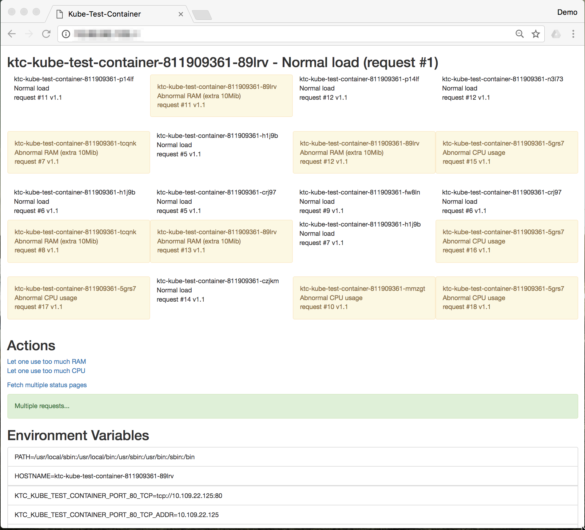

# Kubernetes Test Container

This is a very simple 7.5MB container that you can use to test your [Kubernetes](https://kubernetes.io) cluster.

Simply create a deployment and service with the yaml file:

```
kubectl create -f ./kubernetes/kube-test-container.yaml
```

The containers have already been uploaded so you don't need to build anything here.  But the full 
source is provided here if you want to extend this (Pull Request welcome).

## Scale the deployment

```
kubectl scale deployment kube-test-container --replicas=30
```

## Automatic scaling

Turn on automatic scaling with [HPA](https://kubernetes.io/docs/user-guide/horizontal-pod-autoscaling/)

```
kubectl autoscale deployment kube-test-container --min=10 --max=20
```

## View the status

```
kubectl get deploy,svc kube-test-container
```

## View the status page and generate load

View the external IP Address using the Load Balancer IP `http://IPADDRESS/`.  You will see the correct address marked 
as `EXTERNAL-IP` in the service status (see above).

If you click the "Let one use too much RAM" `http://IPADDRESS/ram` or "Let one use too much CPU" `http://IPADDRESS/cpu`
to trigger one of the container to use too much RAM / CPU (this will grow unbound).  

Click "Fetch multiple status pages" for requesting status `http://IPADDRESS/status`

## External load testing

You can use your favorite benchmarking tool.  The simplest for many would be Apache Benchmark:


```
ab -n 1000 -c 10 http://IPADDRESS/status
```

## Testing upgrades

There are three different versions of this component that only differ in reporting a different version:

* sverrirab/kube-test-container:v1.0
* sverrirab/kube-test-container:v1.1
* sverrirab/kube-test-container:v1.2

```
kubectl set image deployment/kube-test-container kube-test-container=sverrirab/kube-test-container:v1.1
```

## Cleanup

```
kubectl delete deploy,svc kube-test-container
```

# Screenshot



# Building and testing

If you want to make modifications you can use the `./build.sh` script to build a local docker container
and `./run.sh` to test it locally through `http://localhost:8000/`.

# License

MIT License - read the LICENSE file for details.

